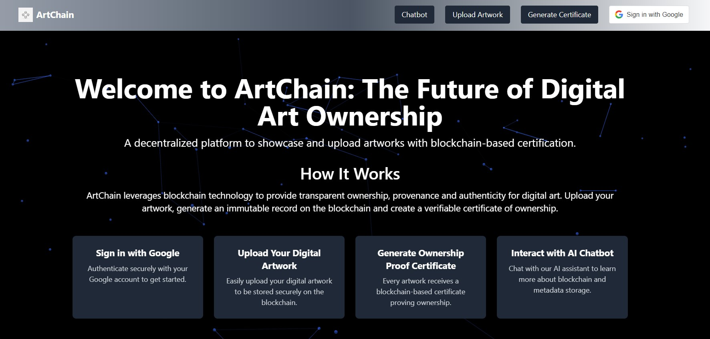

ArtChain is a MERN stack project integrating a private blockchain to provide secure and immutable storage of digital artwork metadata. Artists can upload their artworks, and the system records essential details like title, owner name, description, and a blockchain hash as an unchangeable record.

Key Features:

Google Authentication – Sign in securely with Google.

Blockchain-Powered Storage – Store metadata on a private blockchain for authenticity.

AI Chatbot Assistant – Get AI-powered guidance on blockchain and artwork-related queries.

Ownership Certificate Generation – Generate and download a PDF certificate as proof of ownership.

Storing digital artworks on local devices or MongoDB is not recommended due to potential risks of data loss, tampering, and centralization. Local storage is vulnerable to hardware failures, while MongoDB, though reliable, can be prone to data manipulation or unauthorized access.

Blockchain storage for metadata offers a more secure, decentralized, and tamper-proof solution. It ensures the authenticity and integrity of artwork records, making them immutable and transparent. The blockchain’s distributed nature guarantees that the metadata is not controlled by any single entity, providing greater security and trust in the ownership and provenance of digital art.

This project ensures tamper-proof ownership records for digital artists, providing a decentralized and reliable solution for artwork authentication.
